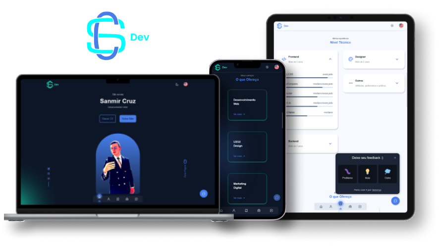

# Portfolio Application - SanCruz


 




## About this Project

This is an application aimed at personal branding, whose objective is to present who I am!

Therefore, you will have access to my **main** skills, experiences, knowledge and my latest completed projects.

## Why?

This project is part of my personal/professional portfolio, so, I will be very happy if you can give me some feedback about the project, code, structure or anything that will help me become a better developer!

In addition, I seek recognition for my dedication to technology, so that more individuals/legal entities get to know my work, because I am concerned with the user, and this is a primordial characteristic of the IT professional, solve problems.


## Features

- Get information about my core skills organized by knowledge level;

- Get information about my projects and professional experience;

- Give any feedback you have in mind or noticed on the site. _The best insight comes from the user_;

- Contact me via direct links to private chats like WhatsApp, Messenger or professional email;

- If you have a project/problem that needs a programmer to solve it, fill out the form and send it with just one click;

- Was the portfolio not enough? Download my resume for more information;

- Use the system on any device or browser;

- Settings
  - Choose the theme you prefer: light or dark;
  - Choose the language you prefer: English or Portuguese-br;


## Main Frameworks/Libs/Tech's

### Front-End

- [**Axios**](https://www.npmjs.com/package/axios) - HTTP Client;
- [**Express**](https://www.npmjs.com/package/express) - server builder;
- [**Framer Motion**](https://www.npmjs.com/package/framer-motion) - animated moves;
- [**i18next**](https://www.npmjs.com/package/react-i18next) - app internationalization;
- [**Phosphor React**](https://www.npmjs.com/package/phosphor-react) - default of project icons;
- [**React**](https://www.npmjs.com/package/react) - UI build;
- [**Sass**](https://www.npmjs.com/package/sass) - CSS preprocessor;
- [**TailwindCSS**](https://www.npmjs.com/package/tailwindcss) - framework CSS;
- [**Typescript**](https://www.npmjs.com/package/typescript) - javascipt typing;
- [**Vite**](https://www.npmjs.com/package/vite) - HMR API over native ESM | code bundling with Rollup;

### Back-End

- [**Cors**](https://www.npmjs.com/package/cors) - middleware activation;
- [**Jest**](https://www.npmjs.com/package/jest) - unit tests;
- [**Nodemailer**](https://www.npmjs.com/package/nodemailer) - send emails from Node.js;
- [**PostgreSQL**](https://www.postgresql.org) - DBMS obejct-relational obejct-relational;
- [**Prisma**](https://www.npmjs.com/package/prisma) - obejct-relational mapping;
- [**SQLite**](https://www.npmjs.com/package/sqlite) - database engine small, fast and self-contained;
- [**Ts Node**](https://www.npmjs.com/package/ts-node) - typeScript execution engine and REPL for Node.js;
- [**Typescript**](https://www.npmjs.com/package/typescript) - javascript typing;

## Practices, Methods and Principles

- Accessibility;
- CI/CD;
- Clean Code;
- CSS Architecture;
- Folder Architecture;
- Responsivity;
- SEO;
- SOLID;
- Unit Tests;
- User Experience;


## Hosting Platforms

- [**Vercel**](https://vercel.com/) - Front-end deployed;
- [**Railway**](https://railway.app/) - Database cloud;

## Getting Started

### Installing

#### Cloning the Repository

``` 
git clone https://github.com/sancruz-dev/portfolio-oficial
```

```
cd portfolio-oficial
```

#### Installing Dependencies

Dependencies must be installed on the folder **server** AND **web**: `C:\portfolio-oficial\server` and `C:\portfolio-oficial\web`

```
npm install 
```

_or_

```
yarn 
```

### Runnning

For the application to run, you will run a single command in two terminals, i.e. in two folders: `server` and `web` (already mentioned above). The command is:

```
npm run dev
```

_or_

```
yarn dev
```

## Author

- ***Sanmir Cruz***

## License 

This project is licensed under the MIT License - see the [LICENSE.md](https://github.com/sancruz-dev/portfolio-oficial/blob/add-license-1/LICENSE.md) file for details


<br/>

<div align="center">


### Contact here

[](https://wa.me/5511972874030)&nbsp;&nbsp;
[](https://discord.gg/vbHXDDDDx7)&nbsp;&nbsp;
[](mailto:sancruz.dev@gmail.com)&nbsp;&nbsp;
[](https://m.me/sanmir.pereira)&nbsp;&nbsp;

</div>

