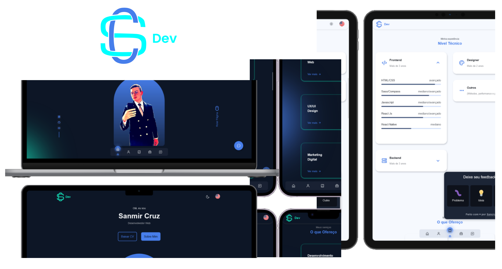

# Portfolio Application - SanCruz

 

## About this Project

Trata-se de uma aplicação voltada à marca pessoal, cujo objetivo é apresentar quem sou eu! 

Portanto, você terá acesso às minhas **principais** habilidades, experiências, conhecimentos e aos meus últimos projetos finalizados.

## Why?

Este projeto faz parte do meu portfólio pessoal/profissional, então, ficarei muito feliz se você puder me fornecer algum feedback sobre o projeto, código, estrutura ou qualquer coisa que sirva de acréscimo para que eu me torne um desenvolvedor melhor!

Ademais, busco reconhecimento pela dedicação que tenho à tecnologia, para que mais pessoas físicas/jurídicas conheçam meu trabalho, pois me preocupo com o usuário, e isso, é uma característica primordial do profissional de T.I, devido o mesmo ser um _solucionador de problemas_.

- principais funcionalidades/features

- frameworks/libs utilizadas (front e back):

- Linguagens

- Métodos e princípios

- plataformas de hospedagem

*** 

